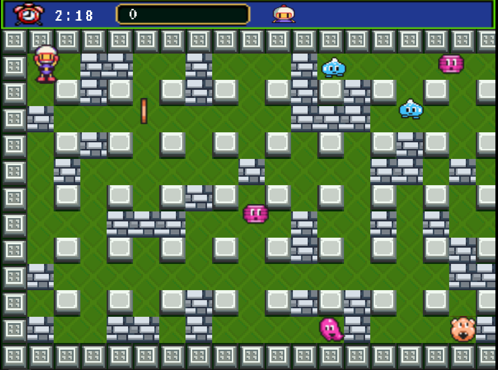
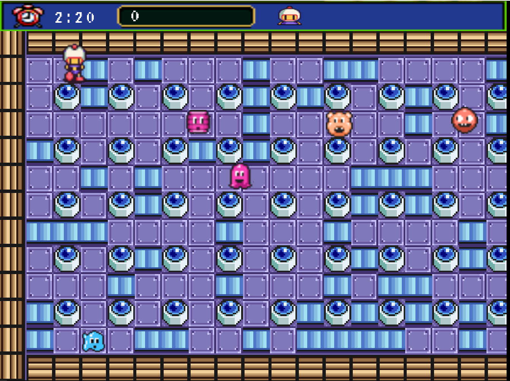
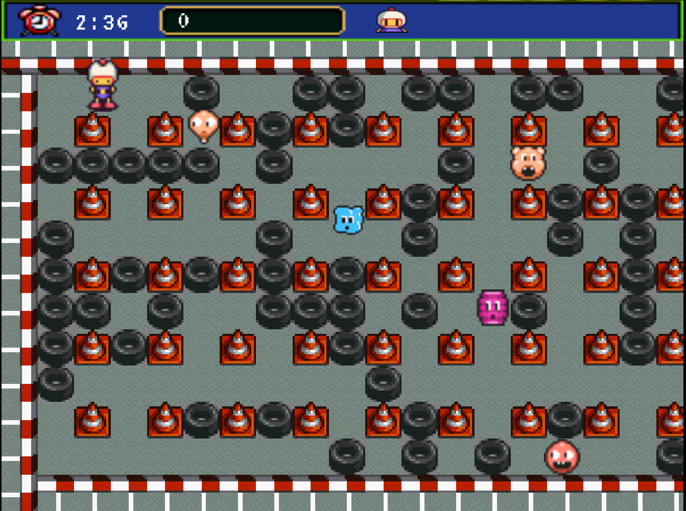
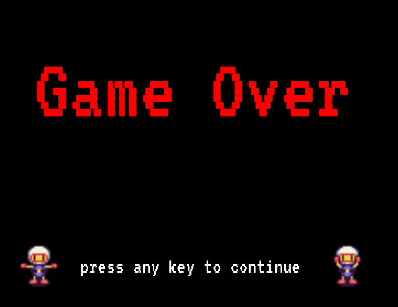

# Bomberman

_OOP Assignment 2. (K65 UET-VNU)_

Thành viên (N2)
- 20020629 Nguyễn Thị Phương Anh
- 20020063 Hoàng Minh Nhật

Mô phỏng lại trò chơi Bomberman bằng Java, sử dụng libGDX.

\

## About
### Player
-  **Bomber** là nhân vật chính của trò chơi. Bomber có thể di chuyển theo 4 hướng trái/phải/lên/xuống theo sự điều khiển của người chơi.
### Enemies

_Enemies sử dụng A* pathfinding_
-  **Balloom** random, 200sc
-  **Oneal** có thể đuổi Bomber, 200sc
-  **Dahl** random, ăn được bomb của Bomber, 400sc
-  **Minvo** nâng cấp của **Oneal**, tốc độ = Bomber ban đầu, 800sc
-  **Doria** có thể đuổi Bomber (chưa cập nhật xuyên tường), 1000sc
-  **Ovape** random, ăn được bomb của Bomber và tăng tốc, 3000sc
-  **Pass** có tốc độ di chuyển cao, chuyển hướng nhanh, 4000sc
-  **Pontan** tốc độ di chuyển cao, tốc độ nhanh random, 8000sc

### Item

-  **FlameItem** tăng phạm vi nổ của Bomb
-  **SpeedItem** tăng tốc độ di chuyển
-  **BomItem** tăng bomb trong queue

## How to play
Game có 3 map, mỗi lượt có 3 phút để chơi.
- ↑ / ↓ / ← / → để di chuyển Bomber
- X để đặt bom.\
- P để tạm dừng trò chơi

**B để hiển thị box2D của các đối tượng**\
**J để random map nhanh**

## Materials

- Sprites [The VG Resource](https://www.spriters-resource.com/snes/sbomber5/), [RomHacking](https://www.romhacking.net/forum/index.php?topic=30619.msg394063#msg394063)
- Sound [Super Bomberman 5](https://downloads.khinsider.com/game-soundtracks/album/super-bomberman-5-original-soundtrack)

## Screenshots

